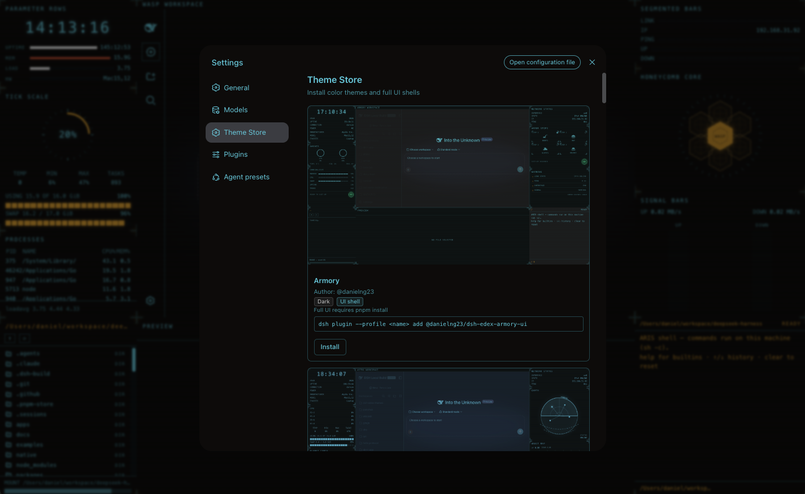

SCIFI/HUD/TERMINAL-style theme store for DeekSeek Harness. 



## eDEX-UI inspired themes

The shell themes in this store are **inspired by [eDEX-UI](https://github.com/GitSquared/edex-ui)** — the sci-fi, fully-featured terminal emulator dashboard. Each variant wraps the default web surface in an eDEX-style frame:

- **Two system info panels** — live system metrics and network activity
- **File directory browser** — filesystem explorer
- **Editor + terminal** — the working surface

Every theme in the catalog is **created by agents**: the variant shells, palettes, and catalog entries are all generated automatically by AI agents, so the whole catalog is a product of automated theme creation rather than hand-authored files.

## Installation

### Install from npm

```bash
pnpm add @deepseek-ai/dsh-client-ui-theme-store
```

### Add to the harness

After installing the package, add the plugin to your harness instance's `cordis.patch.yml`:

```yaml
- id: ui-theme-store
  name: '@deepseek-ai/dsh-client-ui-theme-store'
```

The client bundle is automatically served at `/plugins/@deepseek-ai/dsh-client-ui-theme-store/client.js`.

> "No category, just read a json file from this repo (push to github), theme contains name, author, screenshot."

## What it looks like

A `settings.section` entry named **Theme Store** (order 12, between Models and Plugins) renders a grid of theme cards. Each card shows:

- **Screenshot** — preview image (rendered inside ``, falls back to a palette swatch when the image is broken)
- **Name** — display name of the theme
- **Author** — attribution
- **Scheme badge** — Light or Dark
- **Apply button** — applies the theme; shows "Applied" while the theme is active

Clicking **Apply**:

1. Registers the theme with the harness theme service (`ctx.theme.register(...)`) — idempotent, no crash on duplicate ids.
2. Switches the active preference (`ctx.theme.setTheme(id)`).
3. Persists the applied theme id in the plugin's own durable settings namespace (`ui-theme-store.applied`) so the choice survives reloads — the built-in `ui-theme` schema only accepts `light/dark/system`, so the store owns its own persistence.

## Catalog

The catalog is a JSON document at `catalog/edex-themes.json` in this repository. Its structure:

```json
{
  "themes": [
    {
      "id": "ocean",
      "name": "Ocean",
      "author": "dsh-edex",
      "screenshot": "screenshots/ocean.svg",
      "colorScheme": "dark",
      "tokens": {
        "--dsw-alias-bg-base": "#0d1b2a",
        "--dsw-alias-bg-layer-1": "#14283c",
        "--dsw-alias-bg-layer-2": "#1b344c",
        "--dsw-alias-bg-overlay": "#101f30",
        "--dsw-alias-border-l1": "#2a4a68",
        "--dsw-alias-border-l2": "#3a6385",
        "--dsw-alias-brand-primary": "#4ea1ff",
        "--dsw-alias-label-primary": "#e6eef7",
        "--dsw-alias-label-secondary": "#9db8d0",
        "--dsw-specific-sidebar-fill": "#101f30"
      }
    }
  ]
}
```

### Fields

| Field | Required | Description |
|---|---|---|
| `id` | yes | Theme id (must be unique across the catalog). Used for `ctx.theme.register()`. |
| `name` | yes | Display name. |
| `author` | yes | Author attribution. |
| `screenshot` | yes | Preview image URL. Absolute URLs or paths relative to the catalog's directory. |
| `colorScheme` | yes | Base palette: `"light"` or `"dark"`. |
| `tokens` | yes | Flat map of `--dsw-alias-*` CSS variable overrides. One value per variable (the chosen `colorScheme` decides which base palette is active). |

### Adding a theme

1. Add an entry to `catalog/edex-themes.json`.
2. Add a screenshot image to `catalog/screenshots/` (or reference an external URL in `screenshot`).
3. Push the repo to GitHub — the plugin will pick up the new theme on next load.

### Override-able tokens

The harness defines the following alias tokens (see `@deepseek-ai/dsh-client-ui-theme`):

- `--dsw-alias-bg-base`
- `--dsw-alias-bg-layer-1`
- `--dsw-alias-bg-layer-2`
- `--dsw-alias-bg-overlay`
- `--dsw-alias-border-l1`
- `--dsw-alias-border-l2`
- `--dsw-alias-brand-primary`
- `--dsw-alias-label-primary`
- `--dsw-alias-label-secondary`
- `--dsw-alias-state-error-primary`
- `--dsw-alias-state-success-primary`
- `--dsw-alias-state-warn-primary`
- `--dsw-specific-sidebar-fill`

## Standalone package

This repository is a **standalone npm package** that follows the harness client plugin conventions (`dsh.client` declaration, `exports["./client"]`, closure-factory bundle). It builds, typechecks, and tests independently.

### Quick start

```bash
pnpm install
pnpm run typecheck
pnpm run test
pnpm run build
```

### Integration into the harness

Two ways to compose this plugin into a running DeepSeek Harness GUI:

#### A. Drop-in (recommended for development)

1. Copy the package into the harness monorepo:
   ```bash
   cp -r . /path/to/deepseek-harness/packages/client/ui-theme-store
   ```
2. Add a tsconfig reference — add `{ "path": "packages/client/ui-theme-store" }` to `tsconfig.client.json`'s `references`.
3. Add a dependency — add `"@deepseek-ai/dsh-client-ui-theme-store": "workspace:^"` to `packages/bundle/web-app/package.json`.
4. Add a cordis patch row — insert into `packages/bundle/web-app/cordis.patch.yml`:
   ```yaml
   - id: ui-theme-store
     name: '@deepseek-ai/dsh-client-ui-theme-store'
   ```
5. Rebuild: `pnpm run build:lib:client && pnpm run build:web`.

#### B. External dependency

1. Install the package from npm:
   ```bash
   pnpm add @deepseek-ai/dsh-client-ui-theme-store
   ```
2. Add a row to the cordis patch (see above) and a dependency entry in `web-app/package.json`.
3. The client bundle (`lib/client.js`) is in the correct closure-factory format — the harness modules node half will serve it at `/plugins/@deepseek-ai/dsh-client-ui-theme-store/client.js`.

### Catalog URL

The theme store loads its catalog live from this repository on GitHub, so you can add or change themes by pushing to the repo — no plugin release needed. The default catalog URL is:

```
https://raw.githubusercontent.com/ph4310822/dsh-edex-themes/main/catalog/edex-themes.json
```

If GitHub is unreachable, the store falls back to the bundled catalog served by the plugin's node half at `/catalog/edex-themes.json`.

Override the default at build time by setting the environment variable:

```bash
DSH_CLIENT_THEME_STORE_CATALOG_URL=https://your-raw-url/catalog/edex-themes.json pnpm run build
```

Or edit the constant in `src/client/catalog.ts`.

## Model Experience

None, as the theme store is a browser-side settings surface that reads a JSON catalog and drives the harness theme service — nothing here reaches a model request.

#### KV Cache effect

None; this package neither assembles nor sends a provider request.

## Limitations

- **Third-party theme ids are in-process only** — the harness's built-in `ui-theme` settings schema only accepts `light/dark/system`. The theme store persists its own `applied` id in the `ui-theme-store` settings namespace, so the applied theme survives reloads. However, if the user later picks a built-in preference in the Appearance row, the store's persisted id is cleared on next reload (the built-in preference wins).
- **Remote browsers get no durable settings** — the settings RPCs used for persistence are loopback-only, so a non-loopback browser falls back to process-local selection.
- **Screenshots must be network-accessible** — the catalog JSON references screenshot URLs; the plugin does not bundle them.

## License

MIT